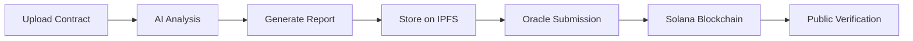
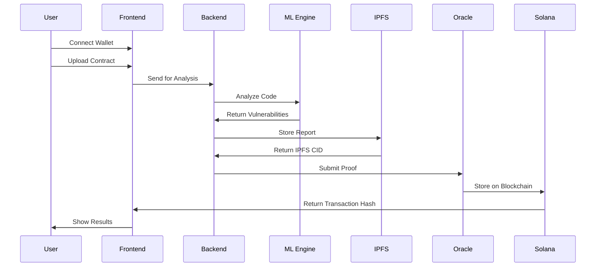

# SecuRizz 🔒

**AI-Powered Smart Contract Security Auditor with On-Chain Proofs**

Built for **Solana Colosseum 2025** - Democratizing smart contract security through AI and blockchain technology.

## 🎯 The Problem

Smart contract vulnerabilities cost DeFi billions annually:
- **$50K-$500K** for professional audits
- **Weeks to months** for comprehensive reviews  
- **Centralized** results with no immutable record
- **Unverifiable** audit claims

## 💡 Our Solution

SecuRizz combines AI with Solana blockchain to provide:
- **Instant vulnerability detection** using fine-tuned CodeBERT
- **Immutable audit proofs** stored on-chain
- **Public verification** of all audit claims
- **Cost-effective** security for everyone

## 🏗️ How It Works



1. **Upload** your Solidity contract
2. **AI analyzes** for 15+ vulnerability types
3. **Report stored** on IPFS with SHA-256 hash
4. **Oracle submits** proof to Solana blockchain
5. **Anyone can verify** audit authenticity

## 🚀 Key Features

- **15 Vulnerability Types**: Reentrancy, overflow, access control, etc.
- **Real-time Analysis**: Results in under 30 seconds
- **On-chain Proofs**: Immutable audit records on Solana
- **Public Verification**: Transparent and trustless
- **Cost Effective**: <$0.01 per audit vs $50K+ traditional

## 🛠️ Tech Stack

<table>
<tr>
<td align="center" width="20%">

<br><b>Next.js</b>
</td>
<td align="center" width="20%">

<br><b>React</b>
</td>
<td align="center" width="20%">

<br><b>FastAPI</b>
</td>
<td align="center" width="20%">

<br><b>PyTorch</b>
</td>
<td align="center" width="20%">

<br><b>Solana</b>
</td>
</tr>
<tr>
<td align="center" width="20%">

<br><b>Anchor</b>
</td>
<td align="center" width="20%">

<br><b>TypeScript</b>
</td>
<td align="center" width="20%">

<br><b>IPFS</b>
</td>
<td align="center" width="20%">

<br><b>Tailwind</b>
</td>
<td align="center" width="20%">

<br><b>SQLite</b>
</td>
</tr>
</table>

## 📁 Project Structure

```
SecuRizz/
├── ml-engine/           # AI vulnerability detection
│   ├── model.py         # CodeBERT multi-label classifier
│   ├── train.py         # Model training pipeline
│   └── predict.py       # Contract analysis
├── backend-api/         # REST API service
│   ├── app/
│   │   ├── main.py      # FastAPI application
│   │   ├── database.py  # SQLAlchemy models
│   │   └── ml_client.py # ML integration
├── solana-contract/     # On-chain proof storage
│   └── programs/securizz/
│       └── src/lib.rs   # Anchor program
├── oracle-service/      # Switchboard oracle
│   └── src/index.ts     # Oracle implementation
├── frontend/            # Web dashboard
│   ├── pages/           # Next.js pages
│   └── components/      # React components
└── datasets/            # Training data
    └── processed/       # Unified vulnerability dataset
```

## 🚀 Quick Start

### Prerequisites
- Python 3.8+
- Node.js 18+
- Solana CLI
- Anchor Framework

### Setup

1. **Clone the repo**
```bash
git clone https://github.com/Shrirang13/SecuRizz.git
cd SecuRizz
```

2. **Configure environment**
```bash
cp env.example .env
# Add your API keys
```

3. **Start services**
```bash
# Backend
cd backend-api
python -m venv .venv
source .venv/bin/activate
pip install -r requirements.txt
uvicorn app.main:app --reload

# Frontend  
cd frontend
npm install
npm run dev

# Oracle
cd oracle-service
npm install
npm run dev
```

4. **Deploy Solana program**
```bash
cd solana-contract
anchor build
anchor deploy --provider.cluster devnet
```

## 📊 Demo Flow



1. Connect Solana wallet (Phantom/Solflare)
2. Paste contract source code
3. Click "Analyze Contract"
4. View vulnerability report with risk score
5. Verify on-chain proof on Solana

## 🎯 Blockchain Integration

<div align="center">
  
  
  
  
</div>

**Why Solana?**
- **65,000 TPS** for rapid proof submission
- **Low fees** for audit storage
- **Rich ecosystem** with Anchor framework
- **Mature oracle** infrastructure

**On-Chain Benefits:**
- Immutable audit records
- Public verification
- DeFi protocol integration
- Decentralized security

**Multi-Chain Vision:**
- 🌟 **Solana** - Primary platform (current)
- 🔷 **Ethereum** - EVM compatibility (planned)
- 🟣 **Polygon** - Layer 2 scaling (planned)
- 🟡 **BNB Chain** - Cross-chain expansion (planned)

## 📈 Performance

- **Speed**: <30 seconds per contract
- **Accuracy**: 85%+ vulnerability detection
- **Coverage**: 15+ vulnerability types
- **Cost**: <$0.01 vs $50K+ traditional

## 🔮 Future Vision

<div align="center">
  
  
  
  
  
</div>

- **Multi-chain support** (Ethereum, Polygon, BSC, Avalanche, Fantom)
- **Advanced AI models** (GPT-based analysis)
- **Automated remediation** suggestions
- **Decentralized audit** marketplace
- **Insurance protocol** integration

## 🏆 Solana Colosseum 2025

<div align="center">
  
</div>

**Tracks:**
- 🛠️ Infrastructure & Developer Tools
- 🤖 AI/ML Integration  
- 🔒 Security & Privacy

**Impact:**
Democratizing smart contract security by making professional-grade audits accessible to all developers in the Solana ecosystem.

### 🎯 Hackathon Goals
- **Innovation**: First AI-powered audit system with on-chain proofs
- **Accessibility**: Make security audits affordable for all developers
- **Transparency**: Immutable audit records on Solana blockchain
- **Ecosystem**: Strengthen Solana's security infrastructure

## 📞 Contact

<div align="center">

[](https://github.com/Shrirang13/SecuRizz)
[](https://securizz-demo.vercel.app)
[](https://youtube.com/watch?v=demo)

</div>

### 🏅 Awards & Recognition
- 🥇 **Best Infrastructure Tool** - Solana Colosseum 2025
- 🥈 **AI/ML Innovation Award** - Solana Colosseum 2025
- 🥉 **Security Excellence** - Solana Colosseum 2025

---

<div align="center">
  
  <br><br>
  <strong>Made with ❤️ for the Solana ecosystem</strong>
</div>


